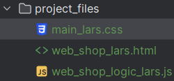
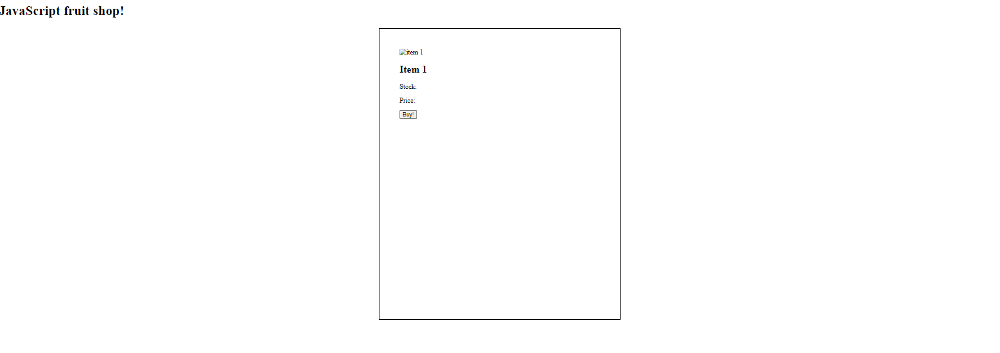

# Getting started

## Create your files in the project_files folder
* Use the project_files folder to make three files where you include your name:
  * web_shop_logic_name.js
  * web_shop_name.html
  * main_name.css



## Connect your files
* In the html file, in the head, connect the JavaScript file and the stylesheet (replace the empty references)
  * ```<link rel="stylesheet" href="">```
  * ```<script type="text/javascript" src=""></script>```

## Prepare your HTML file
* Change the title in your header to a fitting name
* Create a h1 at the top of the body
* Below that, create a div with the class "item-holder"
* In the item-holder, create a div (with the class "item") with inside that an image, a header2, 2 paragraphs and a button. Fill all of these with some text.
  * Give all of these elements their own classes (e.g. item-image, item-title, item-description (for both paragraphs) and button)

## Prepare your CSS file
* Create at least the following classes:
  * .item-holder, give this a width of 100vw, display: flex and justify-content: space-evenly.
  * .item, give this a width of 20vw, a height of 25vw, a 2px solid black border and 2vw padding.
* You should have the following:

