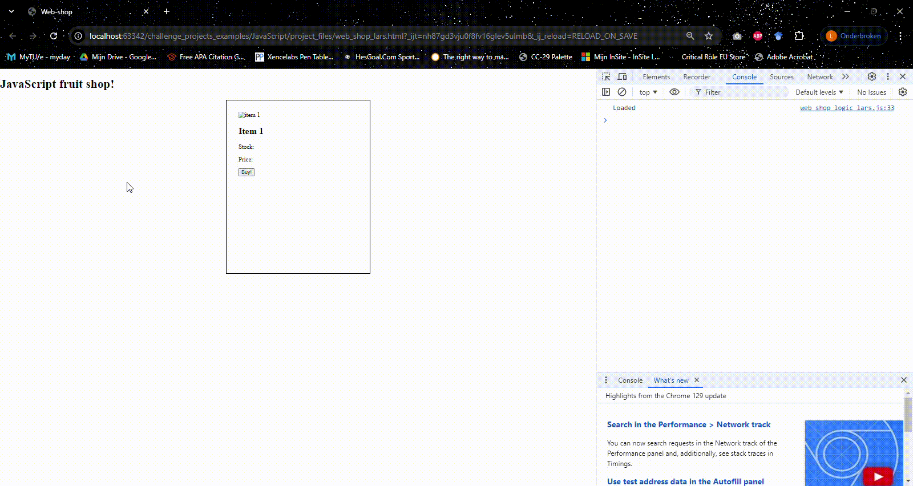

# JavaScript functions
* Make three different [functions](https://www.javascripttutorial.net/javascript-function/):
  * loaded
  * buyProduct(product)
  * cart
* In all three, put a console.log(""); with text in it, so you know when they are used.
  * In buyProduct, also include the variable product in the console log, so that you can distinguish the products later on.

## Do when loaded
* when the [DOM content is loaded](https://developer.mozilla.org/en-US/docs/Web/API/Document/DOMContentLoaded_event), run the loaded function.
  * If you logged correctly, the console should then show "Loaded" when the website is started up.

## Do when clicked
* When a [button is clicked](https://www.w3schools.com/jsref/event_onclick.asp), run buyProduct('apple').
  * If you logged correctly, the console should then show "Bought product: apple" when you click a button.

## Update cart
* Whenever you buy a product, after that, the cart should be updated, so call the cart function at the end of the buyProducts function.
  * If you logged correctly, the console should show "Updated cart" after the "Bought product" log in the console when you click a button.
* Also call loaded again when you click a button.

It should look like this:
