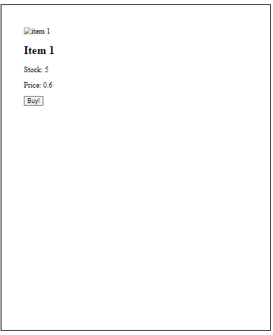
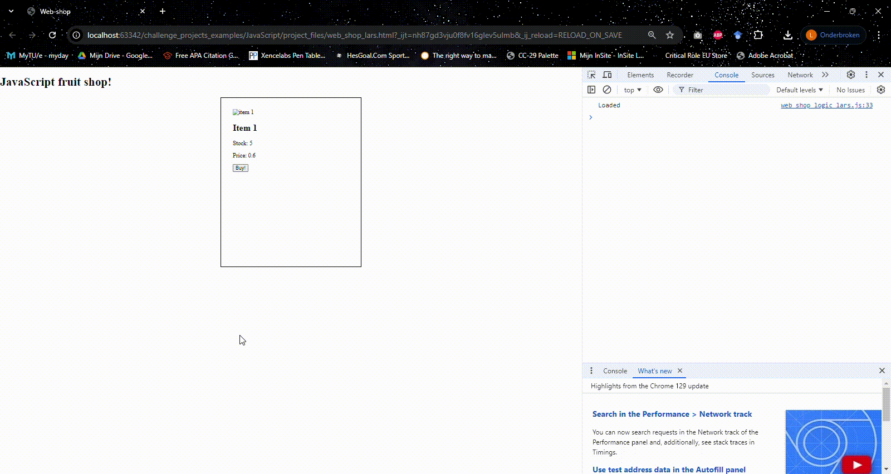

# Datasets and how to use them
## Setup dataset
* At the top of your JavaScript file, paste the following:
```javascript
const data = {
    store: {
        apple: {
            price: 0.60,
            stock: 5
        },
        banana: {
            price: 0.37,
            stock: 8
        },
        pear: {
            price: 0.65,
            stock: 6
        },
    },
    cart: {
        apple: {
            number: 0,
        },
        banana: {
            number: 0,
        },
        pear: {
            number: 0,
        },
    }
};
```

## See price when loaded
* In the loaded function, log the stock and price of the apple (use for example data.store.apple.price)

## Change HTML elements in JavaScript
* In the HTML file, give an id="apple-stock" to the first paragraph element and an id="apple-price" to the second paragraph element
* In the JavaScript loaded function, change the text of the item price and item stock paragraph from your html via your JavaScript file, you'll need to combine the following things:
  * [getElementById](https://www.w3schools.com/jsref/met_document_getelementbyid.asp)
  * [innerText](https://www.w3schools.com/Jsref/prop_node_innertext.asp)
* Then, without changing any text in html, your item box should look like this:


## Change the stock and number of bought items
* In buyProduct, take 1 off the stock when the item is bought.
* Also add 1 to the data.cart.apple.number when the item is bought.

## Restrict when stock is 0.
* With an if statement, make sure the stock can't go below zero. (And no items are added to the cart when stock is 0)
* Your page should look like this:
