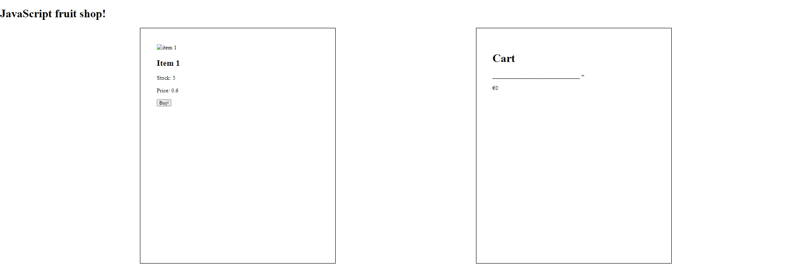
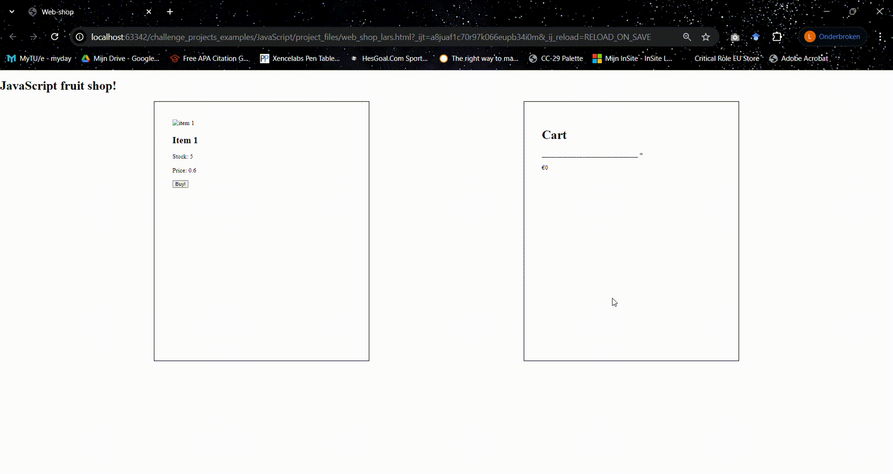

# Cart logic
## Make the cart in html.
* Below the div with the class "item", make another div with the same class.
* In here, create an h2 with the class "item-title" and the text "Cart"
* Create three p's, all with the class "checkout-text"
  * The first one has the id "cart-text"
  * The second one has the following piece of text in it: "_______________________________ +"
  * THe last one has the id "total-price" and the text "€0,-"
  * It should look as follows:

## Make the cart logic
* Use the [createElement and appendChild](https://www.w3schools.com/jsref/met_document_createelement.asp) functions to do the next steps.
* Use getElementById as described in the second example.
* In the cart, make the innerHtml of the cart-text element as follows:
  * 5 Apples * €0,60 = €3,00
  * Make it so that every number is derived from the dataset you have.

* Then, also put the total price on the element with the "total-price" id.
* Also, at the top of the cart function, make sure that cart-text is set to an empty string ("") before you fill it with the other info.
* It should look like this:

