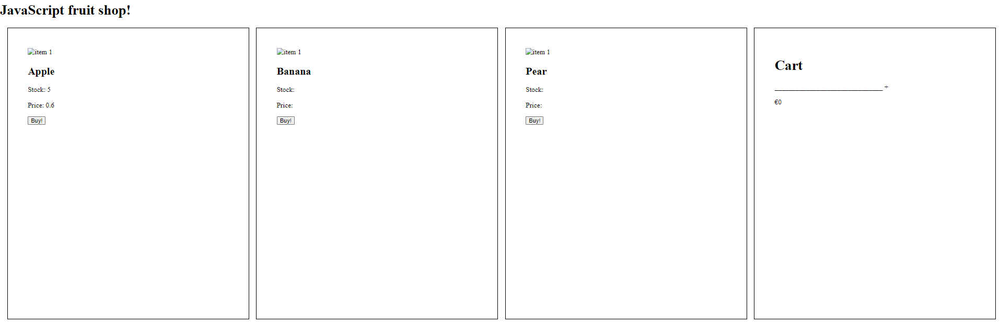
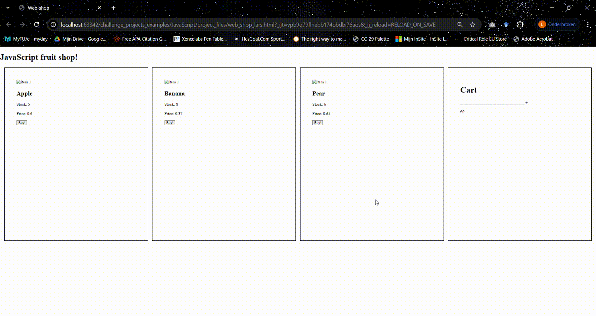
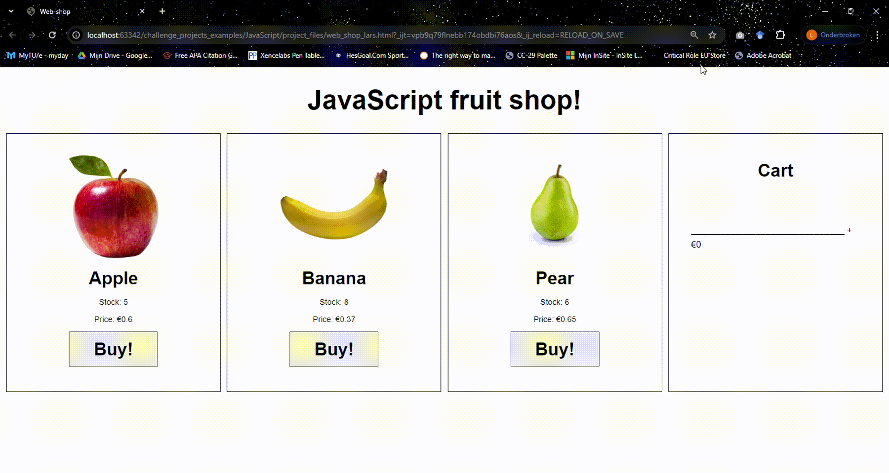

# Multiple items
## Adding two more items to the store
* Duplicate the apple html item box two times and paste it between the apple item-box and the cart.
* Replace the texts with fitting titles and replace the id's with distinguishable ones (No 2 id's can be the same), also look at the variable in onclick.

## Add to your JavaScript logic
* In all functions in your JavaScript file, add logic for the banana and pear items
* In buyProduct, make sure that the parts of apple only run when you buy an apple (and banana code only runs when buying banana, etc.)

## Finishing touch
* [Cap the calculated](https://www.w3schools.com/jsref/jsref_tofixed.asp) values to 2 decimals.
* Only show the items in cart of which you've bought 1 or more.
* Show "Out of stock!" when there are no items in stock anymore.
* Add images to the items.
* Do a bit of CSS magic.

