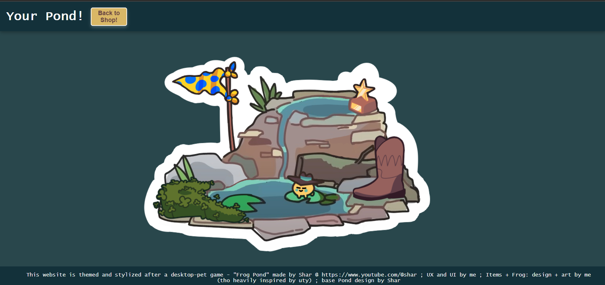

# Frog Pond web-shop!

## Description
>Briefly describe the project, its purpose, and its features.

I'm creating a fake-ish web shop, one immovable page with only one scrollable div :3
for the sake of learning how to, and expressing myself. 
And it's themed after a desktop-pet game - "Frog Pond" made by Shar. [Check credits](#creditsattribution-).
Usage: Introducing users to the game it's all based on. And sharing happiness :)

## Features
>Highlight key features of the web shop.

You can buy 4 different decorations for your desktop pond. If you buy all of them at once you will get a bonus ;)
Then after you bought any of those 4 items, you will see them appear on your pond, which you can find on the pond page, 
it has its own button.

## Technologies Used
>List the technologies and tools used in the project.

Coding languages: html, css, javascript.
Tools I use to find info: Any search engine, my teach, my friends/classmates, ChatGPT.

## Screenshots (Optional but Recommended) 
>Include screenshots of the web shop to give users a visual preview.

Finished pages

## Usage 
>Describe how to use the web shop.

You click buttons, they activate stuff :) 
Check [Features](#features) for a bit better explanation

## Credits/Attribution 
>Acknowledge any resources, libraries, or collaborators.

Inspiration: Frog Pond!game made by Star @ https://www.youtube.com/@shar .
Pictures of the items + bonus: art by me :3
